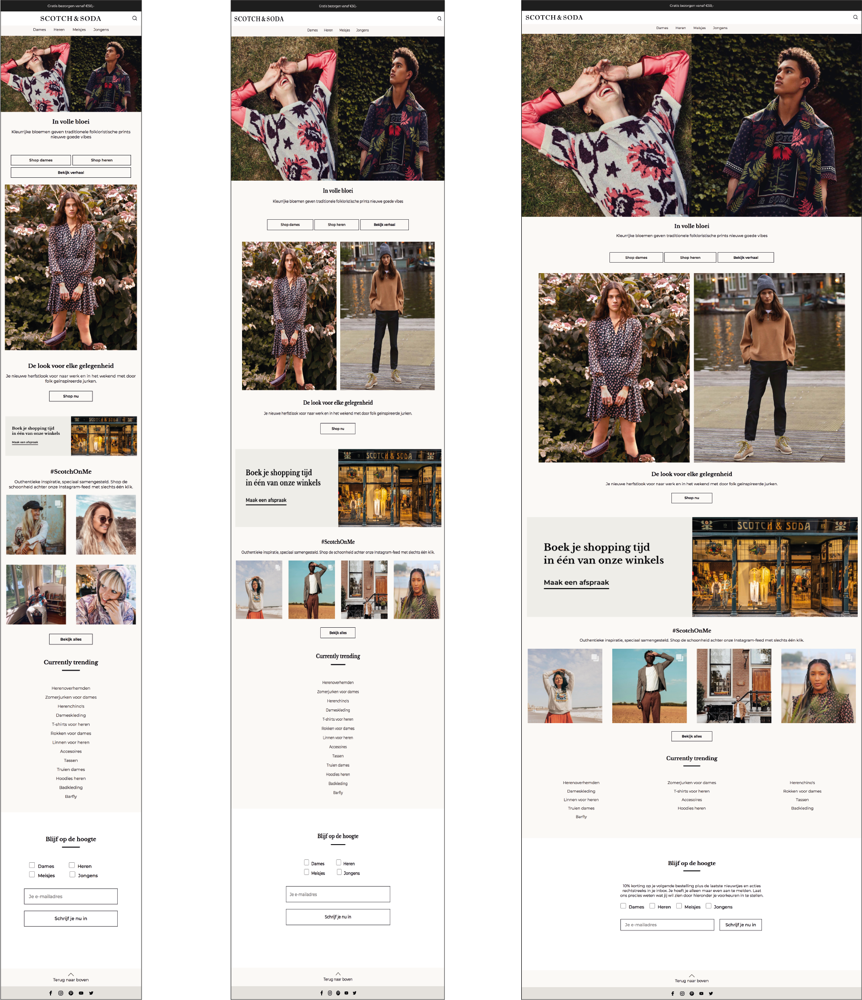
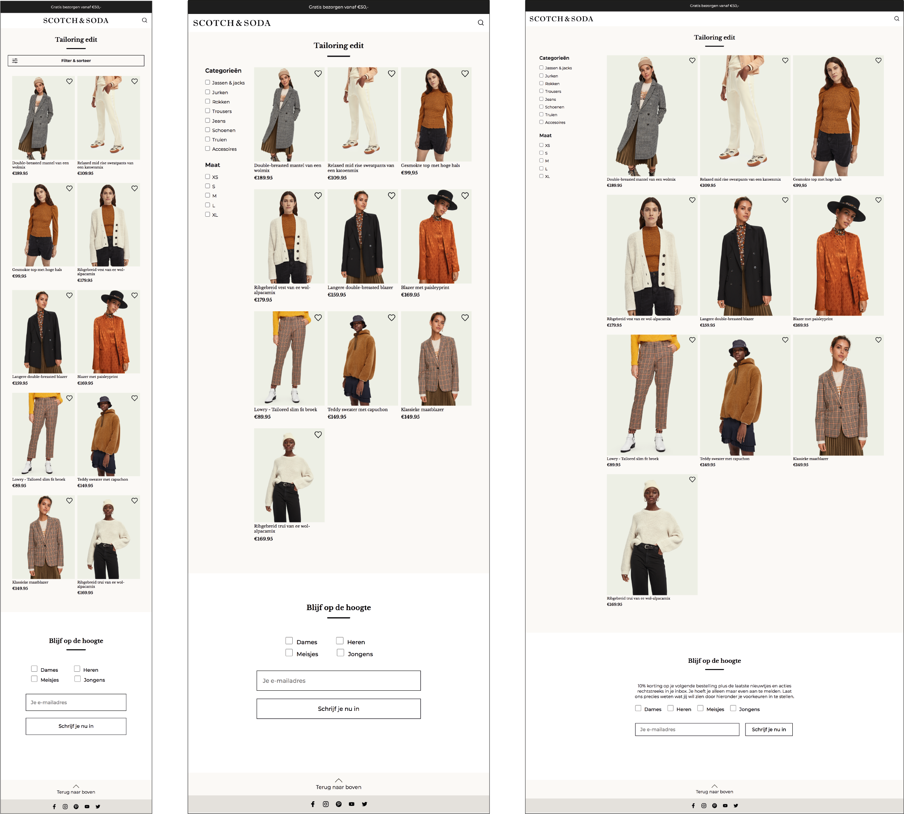
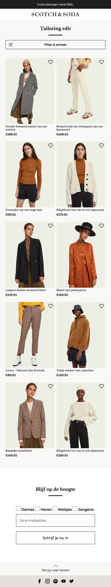
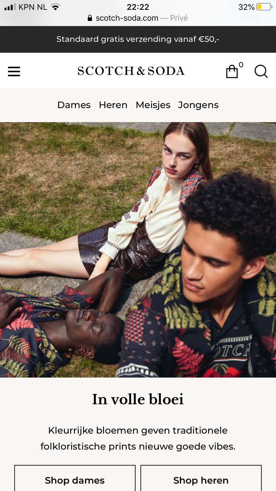
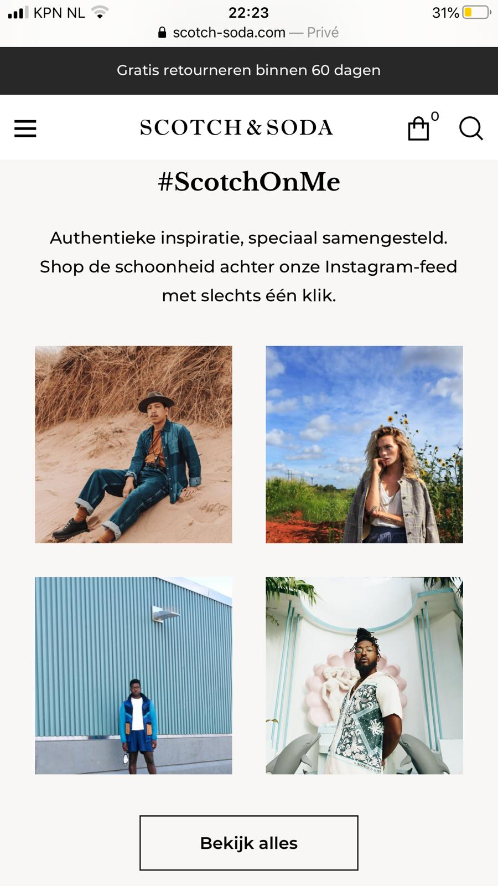
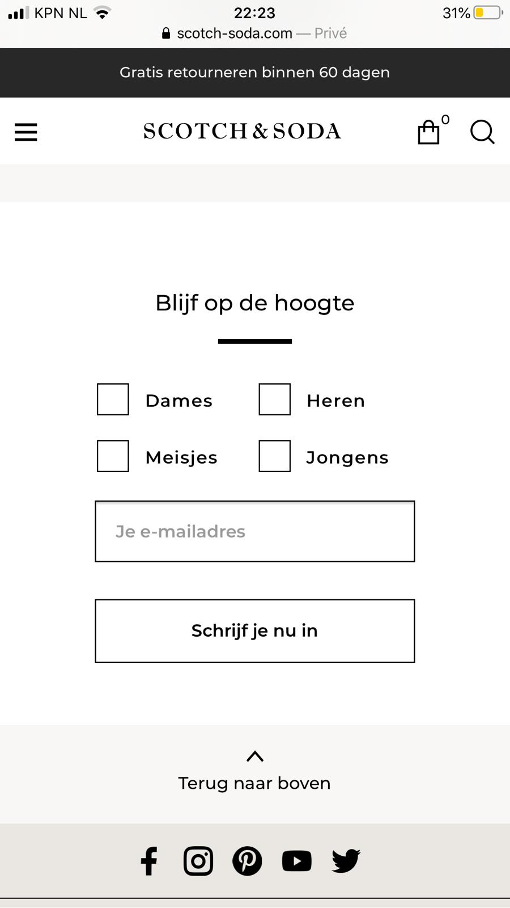
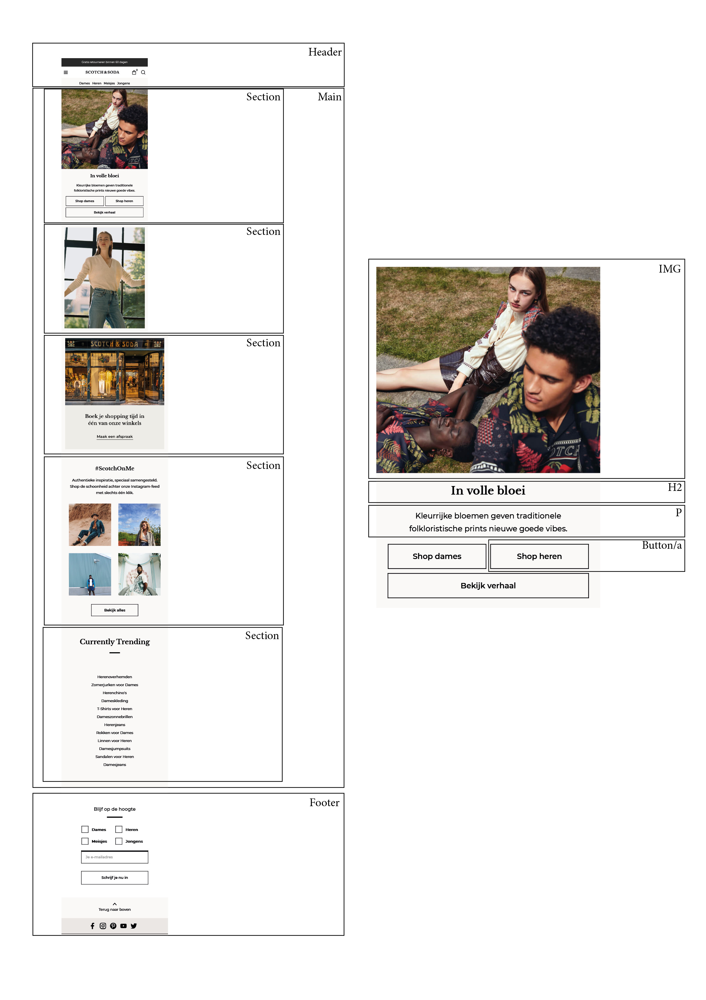

# Procesverslag
**Auteur:** Bibiche Bakkum

Markdown cheat cheet: [Hulp bij het schrijven van Markdown](https://github.com/adam-p/markdown-here/wiki/Markdown-Cheatsheet). Nb. de standaardstructuur en de spartaanse opmaak zijn helemaal prima. Het gaat om de inhoud van je procesverslag. Besteedt de tijd voor pracht en praal aan je website.

## Bronnenlijst

1. DLO - lessen 
2. https://www.w3schools.com/howto/howto_css_custom_checkbox.asp
3. https://css-tricks.com/the-checkbox-hack/
4. https://www.w3schools.com/html/html_forms.asp

## Eindgesprek (week 7/8)

Wat ik vooral erg lastig vond is dat ik veel classes heb gebruikt en die er nu allemaal uit moest halen in de css. Ook javascript is iets waar ik altijd mee gestruggled heb. Maar na een middagje er in verdiepen is het mij toch redelijk gelukt. 

**Screenshot(s):**

-screenshot(s) van je eindresultaat-

## Voortgang 3 (week 6)

**Screenshot(s):**

### Agenda voor meeting

Agenda punten:
- Bij responsive maken afbeeldingen verkleiner maar centreren dan niet meer.
- nog steeds bezig met het filter/grid op de tweede pagina.
- Formulier nog steeds niet goed

### Verslag van meeting
Helaas niet aanwezig kunnen zijn door persoonlijke omstandigheden...

## Voortgang 2 (week 5)

### Stand van zaken

**Screenshot(s):**

### Agenda voor meeting

Agenda punten:
- centreren van een element die nergens naar luistert
- Filter met responsive
- grid met afbeeldingen en tekst

### Verslag van meeting
- op een ander element de grid doen dan werkt het wel.
- Nog steeds uitvogelen hoe ik het formulier goed kan stylen.
- filter ook met een grid. 

## Voortgang 1 (week 3)

### Stand van zaken

Wat er goed ging is: Goed begin gemaakt begin alles weer langzaam te begrijpen.

Aan werken: dingen centreren en knoppen formulier goed krijgen

**Screenshot(s):**

### Agenda voor meeting

Agenda punten:
- Hoe kan je een border en breedte meegeven?
- Flexbox: buttons & justify-content
- Kan een button in een section?
- Instagram of gewoon afbeeldingen
- order-left niet doorlaten lopen
- Form stylen css

### Verslag van meeting

Duidelijk hoe we nu verder kunnen. Werken aan die knoppen. 
Centreren met margin: auto;

## Intake (week 1)

**Je startniveau:** Blauw

**Je focus:** Responsive

**Je opdracht:** https://www.scotch-soda.com/nl/nl/home

**Screenshot(s):**

**Breakdown-schets(en):**

